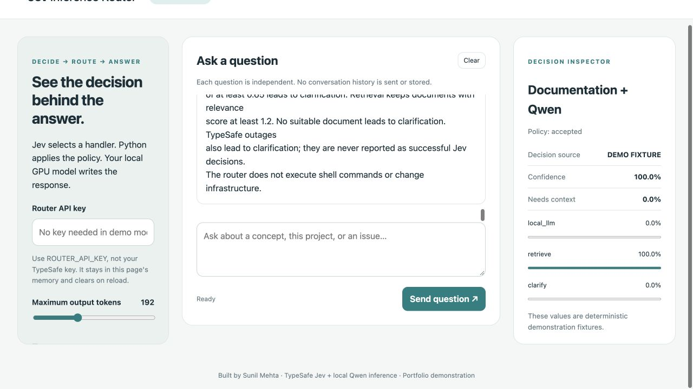

# Jev Inference Router

[](https://github.com/sunilmehta-si/jev-inference-router/actions/workflows/ci.yml)

An observable decision layer for local GPU inference. **TypeSafe Jev chooses the
handler; Python applies the policy; local Qwen generates the answer.**

Built by [Sunil Mehta](https://github.com/sunilmehta-si), alongside
[llm-inference-platform](https://github.com/sunilmehta-si/llm-inference-platform).



*Screenshot uses explicitly labeled offline fixtures. Live results are published separately.*

## What it demonstrates

- Hosted Jev **Choice**, **Noul**, and **Score** questions batched in one API call.
- Routing to local Qwen, project-document retrieval, or clarification.
- A deterministic allowlist answers configuration questions without model calls.
- Browser chat with visible probabilities, policy decisions, sources, timing, and cost.
- Server-side credentials, bounded requests, sanitized failures, and Prometheus metrics.
- Reproducible comparisons against simple rules and local Qwen classification.
- Non-root container packaging and GitHub Actions tests/builds.

## Try without credentials

```sh
git clone https://github.com/sunilmehta-si/jev-inference-router.git
cd jev-inference-router
make setup
make demo
```

Open **http://127.0.0.1:8100/**. Offline mode uses deterministic fixtures and does not
call Jev or generate LLM answers. No key or GPU is required for this mode.

## Use live Jev and your GPU

Copy `.env.example` to `.env`, set `ROUTER_MODE=live`, and configure your TypeSafe,
router, and local gateway keys. Start the companion Qwen engine and gateway, then
run `make serve`. In the UI, enter **ROUTER_API_KEY**, never the TypeSafe key.

Follow the [complete local walkthrough](docs/local-walkthrough.md) for exact commands.
Jev runs through a hosted API; Qwen runs natively on Apple Silicon through vllm-metal.
The TypeSafe key stays server-side in the ignored private `.env` file.

## Measured demonstration results

Fixed suite: **24 manually labeled synthetic questions**, 8 per intended route.
Measured on 6 October 2026 from India, with Jev 1.13.0 and local Qwen2.5-7B 4-bit
on an Apple M5 Pro. Results are application-specific, not a general model benchmark.

| Decision system | Expected routes matched | p50 routing latency | p95 routing latency |
|---|---:|---:|---:|
| Jev plus routing policy | 22/24 (91.7%) | 387 ms | 491 ms |
| Local Qwen JSON classification | 21/24 (87.5%) | 1,693 ms | 3,240 ms |
| Simple keyword rules | 22/24 (91.7%) | Not instrumented | Not instrumented |

Jev correctly selected retrieval on two documentation questions, but the confidence
policy abstained at 0.59 and 0.64. Rules instead misrouted two clarification cases.
There were **0 selected-route disagreements in 24 reversed-option checks**. This
suite does not establish robust calibration or general superiority over rules.

The Qwen baseline generates a JSON label; Jev returns distributions and relevance
scores. Their work differs, so the latency comparison is not a universal speed claim.
The estimated cost of 48 Jev calls was **$0.00213503**, using reported input tokens
and public pricing, excluding retries. Both Jev and Qwen returned valid results for
all 24 primary evaluation requests after the local engine was started.

See [methodology and failure cases](evaluations/README.md),
[raw live results](evaluations/live-results.json), and
[four-route end-to-end evidence](evaluations/end-to-end.json).

## Verify

```sh
make check          # lint, formatting, 13 automated tests
make secrets        # configured keys absent from Git index and history
make evaluate       # offline fixtures, no API calls
make evaluate-live  # 48 Jev calls + 24 local Qwen classification calls
```

Container demo:

```sh
docker build -t jev-inference-router:local .
docker run --rm -p 127.0.0.1:8100:8100 jev-inference-router:local
```

The container packages the router, UI, and documents, not a GPU engine. Live use in
Docker Desktop needs `--env-file .env` and
`-e LLM_BASE_URL=http://host.docker.internal:8000/v1`.

## Design and limits

Read the [architecture](docs/architecture.md), [operations guide](docs/operations.md),
and [local walkthrough](docs/local-walkthrough.md).

This is a portfolio demonstration with single-process limits and a small lexical
knowledge store. It does not execute infrastructure changes. Generated citations
are not independently verified. Public cloud hosting is not deployed. Confidence
thresholds are starting values, not production-calibrated guarantees.

Application code is MIT licensed. Jev is a separately hosted service under TypeSafe's
terms. The official SDK is used as a dependency, not copied into this repository.

- [TypeSafe API](https://docs.typesafe.ai/api)
- [Jev model limitations](https://docs.typesafe.ai/model-jaggedness/jev-1.13)
- [Official Python SDK](https://github.com/typesafe-ai/typesafe-sdk-python)
