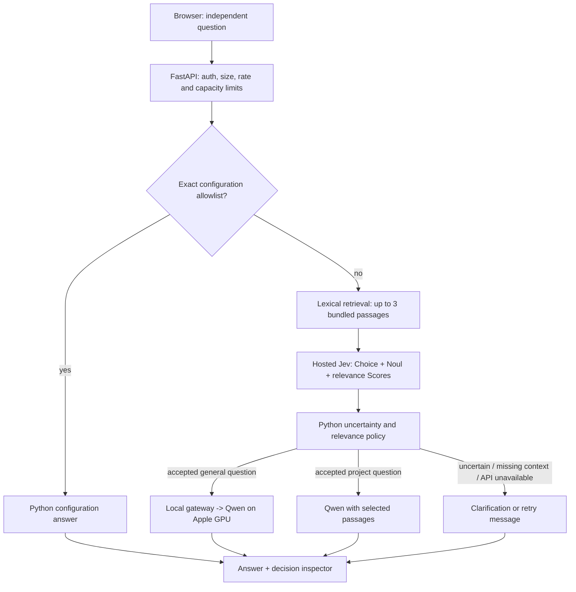

# Architecture and request flow

The application uses the official `typesafe-sdk` asynchronous client. A single Jev
request batches route selection, missing-context probability, and one relevance Score
per candidate passage. The model ID is pinned to `jev-1.13.0`; response IDs are recorded
in evaluations. Choice and Score confidence are distribution summaries, not independent
correctness guarantees. Noul exposes a probability, not a separate confidence value.

The policy uses a demonstration confidence floor of 0.65 and a missing-context
probability threshold of 0.65. Retrieval requires at least one passage scoring 1.2
on a 0–2 relevance rubric. These thresholds need domain-specific validation before
production use. The small published suite is not sufficient to calibrate them.

Qwen receives a system instruction plus the independent user question. Retrieval
answers also receive selected source passages with filenames. Filenames displayed in
the inspector indicate supplied context; they do not prove every generated assertion
is grounded. Automated answer-quality and citation verification are future work.

Demo mode substitutes deterministic rules and reference text. Its probability values
are artificial fixtures and its latency is not a Jev measurement. Live mode makes paid
hosted API requests and requires server-side credentials. The TypeSafe key never
travels to the browser; the local router key authenticates browser requests.

The knowledge store is three application-owned Markdown files. Retrieval is lexical
cosine similarity over word counts, not embeddings or a vector database. It can miss
paraphrases; absence of useful passages results in clarification. There is no remote
document ingestion, shell execution, infrastructure modification, or agent tool loop.
